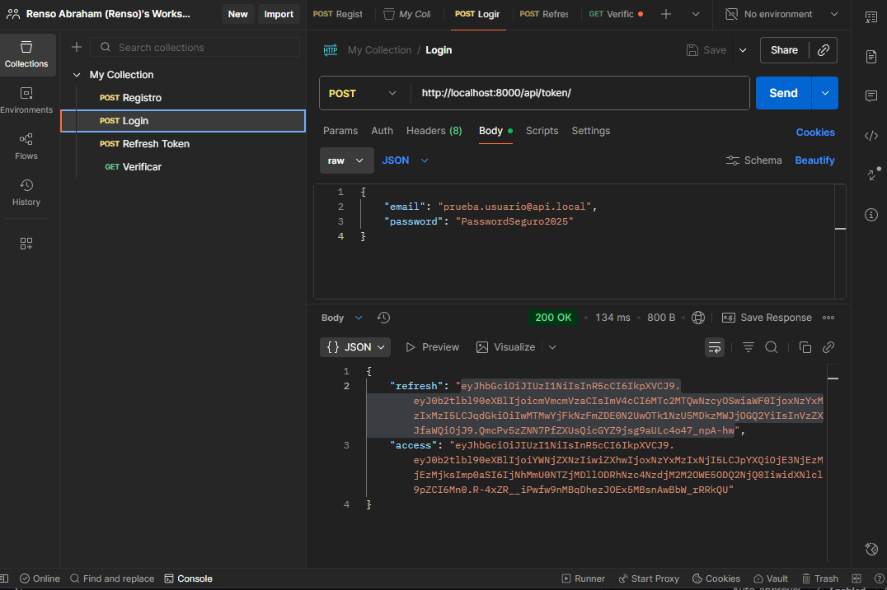
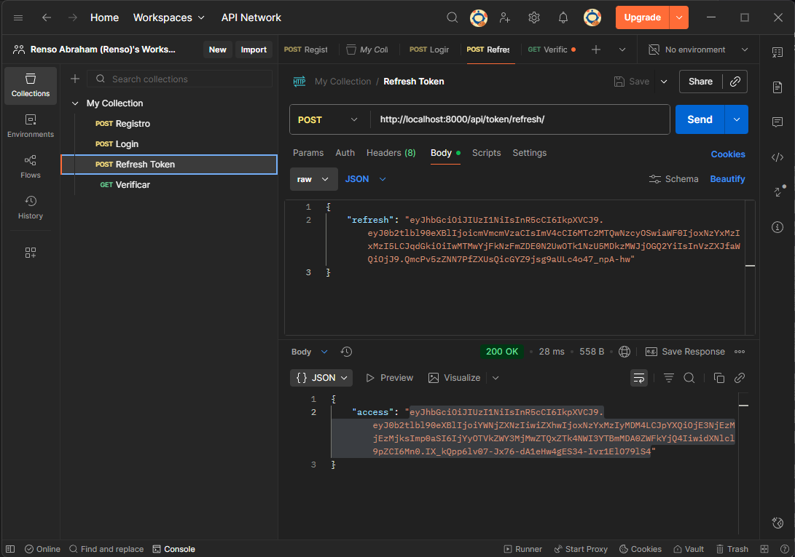
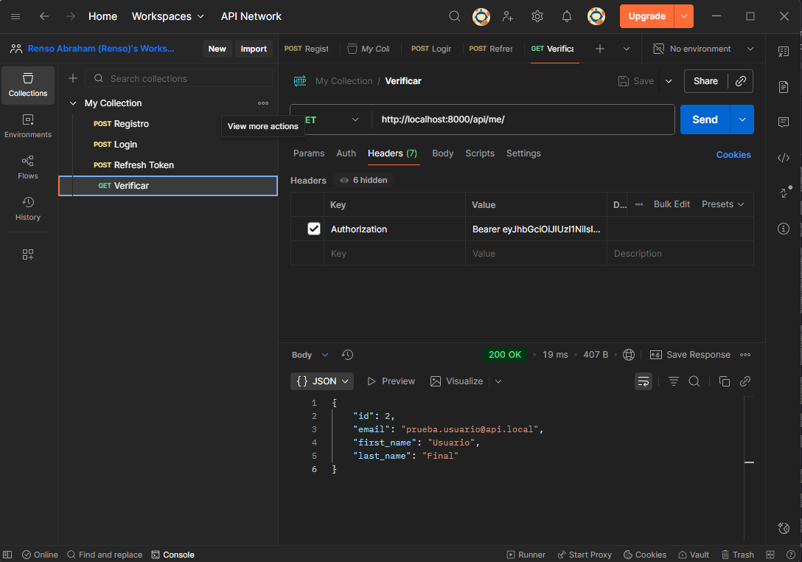

# Servicio de Autenticación (auth-service)

Este servicio es el encargado de la **autenticación y autorización** de usuarios dentro del ecosistema de microservicios. Se encarga del registro, inicio de sesión y validación de tokens JWT para el acceso seguro a los demás servicios.

## Tecnologías Implementadas

| Componente | Tecnología | Propósito |
| :--- | :--- | :--- |
| **Backend** | Python 3.11, Django | Base del servicio. |
| **Autenticación** | Djoser, Simple JWT | Manejo de registro, tokens de acceso y refresco. |
| **Base de Datos** | PostgreSQL | Persistencia de datos de usuarios. |
| **Cache/Sesiones** | Redis | Gestión de sesiones y cache (a través de Docker Compose). |
| **Contenedores** | Dockerfile, docker-compose.yml | Orquestación del entorno de desarrollo. |

## Endpoints Principales

Todos los *endpoints* están disponibles a través del puerto `8000` del contenedor `auth-service`.

| Método | Ruta | Descripción | Estado |
| :--- | :--- | :--- | :--- |
| `POST` | `/auth/users/` | **Registro** de un nuevo usuario (con email y contraseña). | Funcional |
| `POST` | `/api/token/` | **Login** - Obtiene los tokens de acceso y refresco. | Funcional |
| `POST` | `/api/token/refresh/` | **Refresco** - Renueva el token de acceso. | Funcional |
| `GET` | `/api/me/` | **Verificar/Obtener Usuario** - Devuelve los datos del usuario autenticado (requiere token de acceso). | Funcional |

## Evidencia de Pruebas Exitosas (Postman)

El siguiente flujo demuestra el correcto funcionamiento de la autenticación JWT.

### 1. Login y Generación de Tokens (POST /api/token/)

Verificación del login con email y contraseña, generando tokens `access` y `refresh`.

### 2. Renovación de Token (POST /api/token/refresh/)

Verificación de la renovación del token de acceso (Access) utilizando el token de refresco (Refresh).

### 3. Verificación de Usuario (GET /api/me/)

Verificación del acceso a una ruta protegida usando el token Access en la cabecera `Authorization: Bearer <token>`.

